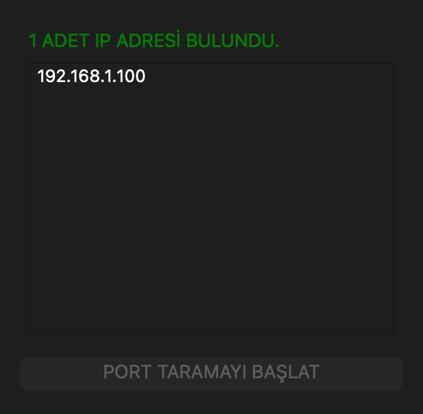
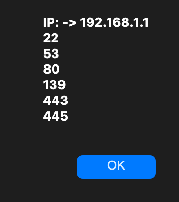

# NetScanner

Yerel ağdaki cihazları bulup, seçtiğin cihazda açık TCP portlarını listeleyen küçük bir masaüstü uygulaması. 2021'de Python öğrenirken yazdım — nmap'i bir arayüzün arkasına koyup "kendi tarama aracımı yapsam ne olur" diye merak etmiştim.

> **EN:** A small PyQt5 desktop app that sweeps the local network with nmap and TCP-connect scans the host you pick. Written in 2021, kept as-is — with an honest re-run and a self code review at the bottom.



## Ne yapıyor

İki dosya var ve iş bölümü net: ağ işleri bir tarafta, arayüz diğer tarafta.

**`iplib.py`** — arayüzden bağımsız ağ katmanı:

- `networkScan()` → `python-nmap` üzerinden `nmap -sn 192.168.1.1/24` çalıştırır. `-sn` "ping sweep" demek: hangi cihazlar ayakta onu bulur, port taramaz. Ayakta olan hostları listeye doldurur, kaç tane bulunduğunu ekrana yazar (bulursa yeşil, bulamazsa kırmızı).
- `portScan(ip)` → 0–499 arası portlara sırayla `socket.connect_ex()` ile bağlanmayı dener. Dönüş değeri `0` ise port açık kabul edilir ve listeye eklenir.

**`testqt1.py`** — PyQt5 arayüzü: durum etiketi, bulunan IP'lerin listesi ve "PORT TARAMAYI BAŞLAT" düğmesi. Ağ taraması ve düğmenin aktif/pasif kontrolü `_thread` ile arka planda dönüyor, amaç tarama sürerken pencerenin donmaması.

Akış basit: uygulamayı aç → ağ taranır → listeden bir IP seç → düğmeye bas → o IP'nin açık portları bir mesaj kutusunda çıkar.

## Çalıştırmak için

nmap'in kendisi kurulu olmalı; `python-nmap` sadece onu dışarıdan çağıran bir sarmalayıcı:

```bash
brew install nmap              # macOS   (Debian/Ubuntu: sudo apt install nmap)
pip install PyQt5 python-nmap
sudo python testqt1.py
```

`sudo` zorunlu değil ama onsuz tarama neredeyse boş dönüyor — sebebi hemen aşağıda.

Bir de şunu söylemek gerekiyor: bu tür bir aracı sadece kendi ağında çalıştır. Başkasının ağını izinsiz taramak birçok yerde suç.

## Beş yıl sonra tekrar çalıştırdım

Kodu hiç değiştirmeden bugün (Eylül 2026) çalıştırdım. Çalışıyor — yukarıdaki ekran görüntüsü o çalıştırmanın gerçek çıktısı. Ama iki şey dikkatimi çekti.

**Root yetkisi olmadan ağdaki cihazların çoğunu kaçırıyor.** Ekran görüntüsünde 192.168.1.0/24 ağında sadece tek bir cihaz görünüyor: makinemin kendisi. Oysa aynı anda router'a (192.168.1.1) ping attığımda sorunsuz cevap veriyordu, yani cihaz ayaktaydı ve tarama onu kaçırdı. Sebebi nmap'in belgelenmiş davranışı: yerel ağda `-sn` taraması için ARP paketleri kullanıyor, ham paket göndermek de root yetkisi istiyor. Yetkisiz çalıştırıldığında nmap TCP tabanlı bir yönteme düşüyor ve çoğu cihaz o yolla görünmüyor. Programın asıl sorunu bunu yapması değil — bunu kullanıcıya hiç söylememesi. Ekranda yeşil yeşil "1 ADET IP ADRESİ BULUNDU" yazıyor, sanki ağda gerçekten bir cihaz varmış gibi.

**Port taraması pratikte kullanılamayacak kadar yavaş.** Router'ı (192.168.1.1) taradım, sonuç doğru çıktı:



Ama bu sonucun gelmesi **8 dakika 18 saniye** sürdü. Sebep şu: kapalı portlar bu cihazda yaklaşık 1 saniyede cevap veriyor ve kodda ne `settimeout()` var ne de eşzamanlılık — 500 port tek tek, birbirini bekleyerek taranıyor. Karşılaştırma için: kendi makinemi taradığımda aynı 500 port 0,07 saniyede bitti, çünkü orada kapalı portlar anında RST dönüyor. Yani bu yavaşlık hızlı cevap veren bir hedefte hiç fark edilmiyor, gerçek bir cihazda anında ortaya çıkıyor.

## Bugün neyi farklı yapardım

Kodu bilerek düzeltmedim; 2021'de nerede olduğumun kaydı olarak duruyor. Ama şu an bakınca gördüklerim:

**Qt nesnelerine arka plan thread'inden dokunuyorum.** `networkScan()` bir `_thread` içinde çalışıyor ama içeride `list_widget.addItem()` çağırıyor. Qt'de arayüz nesnelerine yalnızca ana thread'den dokunulmalı; doğrusu `QThread` kullanıp sonucu sinyalle ana thread'e taşımak. Şu an çalışıyor ama bu garanti değil, "şansa çalışan" bir kod.

**`buttonSettings` bir CPU çekirdeğini boşuna yakıyor.** İçinde bekleme olmayan bir `while True` döngüsü, saniyede milyonlarca kez `setEnabled()` çağırıyor. Doğrusu listenin `itemSelectionChanged` sinyaline bağlanmak — hem bedava hem doğru. (Bu da ayrıca thread'den arayüze dokunma sorununu içeriyor.)

**Sabit değerler kodun içine gömülü.** Ağ aralığı `192.168.1.1/24` ve port aralığı `0–499` doğrudan koda yazılmış. İkisi de arayüzden girilebilmeliydi; şu haliyle uygulama sadece tek bir ağ şablonunda işe yarıyor.

**Timeout ve eşzamanlılık yok.** `socket.settimeout(0.5)` ve bir `ThreadPoolExecutor` ile aynı tarama dakikalar yerine saniyeler sürerdi.

**`except Exception: pass` hatayı yutuyor.** Bugün tarama boş dönünce sorunun nerede olduğunu anlamak için kodu ayrı ayrı çalıştırmam gerekti — çünkü bir şey ters gitse bile program bunu hiç söylemiyor.

**Küçük şeyler:** `from socket import *` (isim çakışması riski), `msgBox.exec()` ile `msgBox.exec_()` karışık kullanılmış, dosya `if __name__ == "__main__"` bloğu olmadan `window();` diye noktalı virgülle bitiyor. Bir de `for i in range(0, 500)` satırının yorumunda "Aralığımızı 0 10 olarak belirliyoruz" yazıyor — aralık bir noktada değişmiş, yorum güncellenmemiş.

Bu listeyi çıkarabilmek, kodu ilk yazdığım zamana göre asıl ilerlemenin nerede olduğunu gösteriyor bence.
